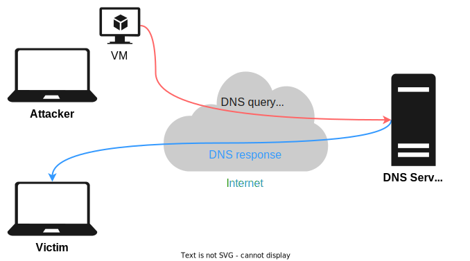

<h1> Simple DNS Reflection & Amplification Attack </h1>



<h2> Concepts </h2>

* An attacker leverages the functionality of **open DNS resolvers** in order to overwhelm a target server or network with an amplified amount of traffic.
* To achieve this attack
  * **Reflection**: The attacker fabricates the packets' information (ex: Source IP, port) with the victim's information.
  * **Amplification**: Use special DNS query to generate a large response.

<h2> Implementation </h2>

* Create raw sockets.
  * root privilege
* Generate IP-level packets with spoofed information.  
  * ip header → source ip
  * udp header → source port
* A good DNS query for amplification.
  * query type: `ANY`
  * additional record: `EDNS0` extend the maximum size of udp packet
  * requested domain name: `isc.org` `ieee.org` `ietf.org`

<h2> Usage </h2>

Build dns_attack.
```
make
```

This will generate 3 DNS queries to the DNS Server and reflect the reponses to victim IP.
```
./dnsattack <Victim IP> <UDP Source Port> <DNS Server IP>
```